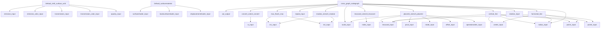

```mermaid
graph TD
    Default_Unlit[Default_Unlit_surface_unlit]
    emission[emission_input]
    Default_Unlit --> emission
    emission_color[emission_color_input]
    Default_Unlit --> emission_color
    transmission[transmission_input]
    Default_Unlit --> transmission
    transmission_color[transmission_color_input]
    Default_Unlit --> transmission_color
    opacity[opacity_input]
    Default_Unlit --> opacity
    Default[Default_surfacematerial]
    surfaceshader[surfaceshader_input]
    Default --> surfaceshader
    backsurfaceshader[backsurfaceshader_input]
    Default --> backsurfaceshader
    displacementshader[displacementshader_input]
    Default --> displacementshader
    cross_graph[cross_graph_nodegraph]
    out[out_output]
    cross_graph --> out
    convert_color4[convert_color4_convert]
    in[in_input]
    convert_color4 --> in
    cross_graph --> convert_color4
    max_float1[max_float1_max]
    in1[in1_input]
    max_float1 --> in1
    in2[in2_input]
    max_float1 --> in2
    cross_graph --> max_float1
    repeat[repeat_input]
    cross_graph --> repeat
    scale[scale_input]
    cross_graph --> scale
    texcoord_vector3[texcoord_vector3_texcoord]
    index[index_input]
    texcoord_vector3 --> index
    cross_graph --> texcoord_vector3
    place2d_vector3[place2d_vector3_place2d]
    texcoord[texcoord_input]
    place2d_vector3 --> texcoord
    pivot[pivot_input]
    place2d_vector3 --> pivot
    scale[scale_input]
    place2d_vector3 --> scale
    rotate[rotate_input]
    place2d_vector3 --> rotate
    offset[offset_input]
    place2d_vector3 --> offset
    operationorder[operationorder_input]
    place2d_vector3 --> operationorder
    cross_graph --> place2d_vector3
    vertical[vertical_line]
    texcoord[texcoord_input]
    vertical --> texcoord
    center[center_input]
    vertical --> center
    radius[radius_input]
    vertical --> radius
    point1[point1_input]
    vertical --> point1
    point2[point2_input]
    vertical --> point2
    cross_graph --> vertical
    modulo_vector3[modulo_vector3_modulo]
    in1[in1_input]
    modulo_vector3 --> in1
    in2[in2_input]
    modulo_vector3 --> in2
    cross_graph --> modulo_vector3
    horizontal[horizontal_line]
    texcoord[texcoord_input]
    horizontal --> texcoord
    center[center_input]
    horizontal --> center
    radius[radius_input]
    horizontal --> radius
    point1[point1_input]
    horizontal --> point1
    point2[point2_input]
    horizontal --> point2
    cross_graph --> horizontal
    radius[radius_input]
    cross_graph --> radius
    rotation[rotation_input]
    cross_graph --> rotation
```
